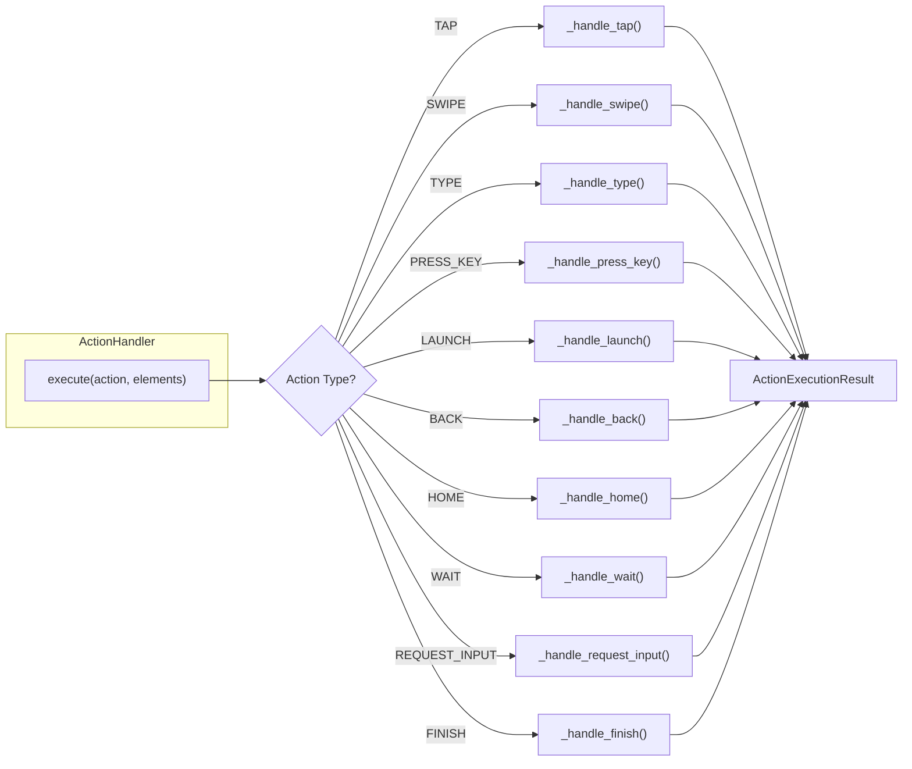
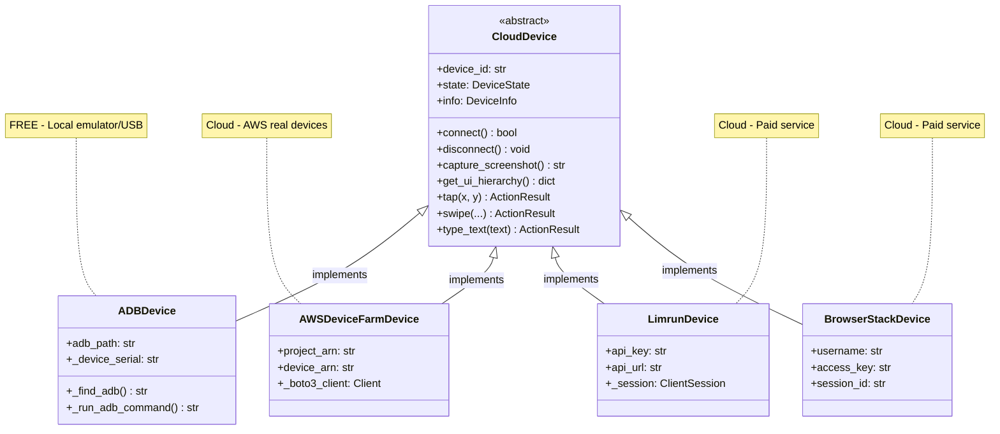
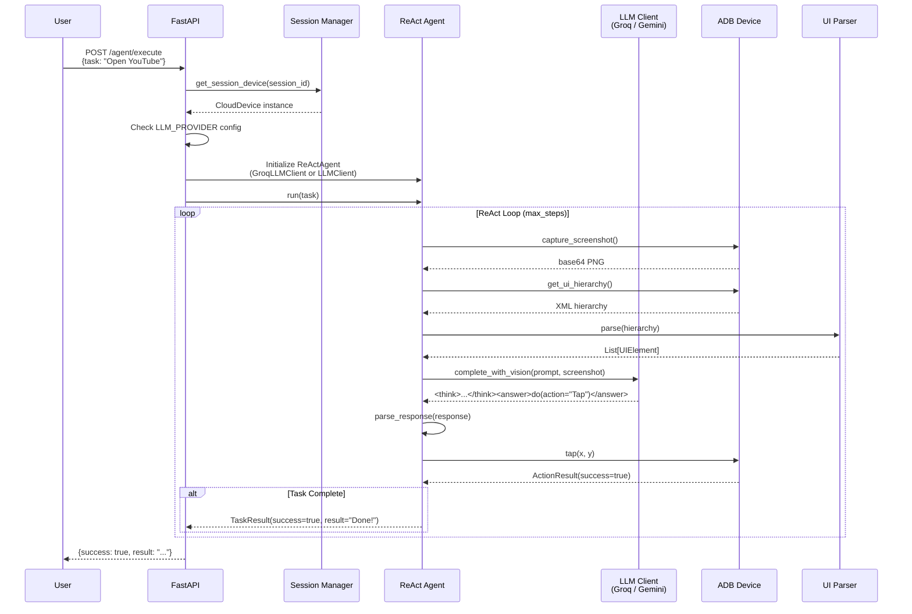
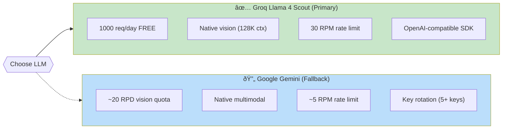
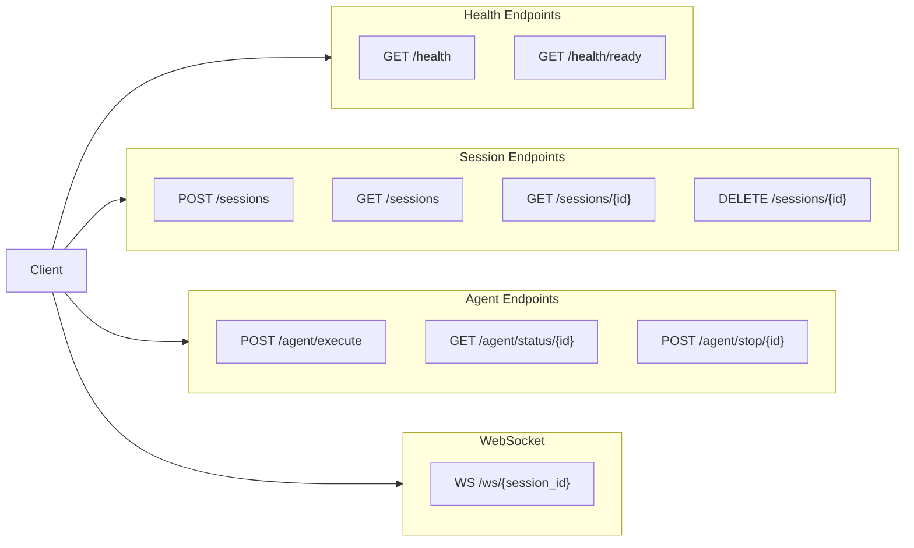
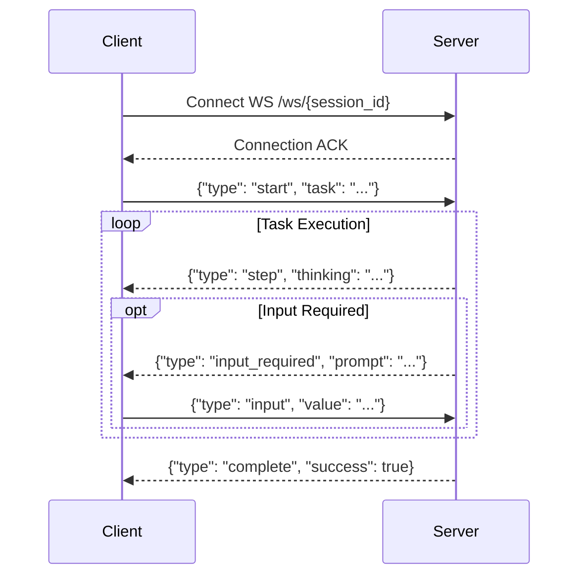
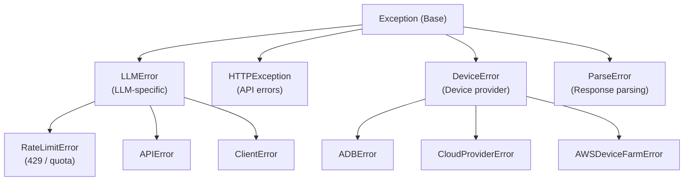

<div align="center">
# Android AI Agent - Architecture Documentation
</div>

> **Purpose**: This document provides a comprehensive guide to the Android AI Agent's architecture, design decisions, and implementation details. It is designed to help you confidently explain the project in technical interviews.

---

## Table of Contents

1. [Executive Summary](#executive-summary)
2. [System Architecture Overview](#system-architecture-overview)
3. [Core Components](#core-components)
4. [Design Patterns & Principles](#design-patterns--principles)
5. [Data Flow](#data-flow)
6. [Key Technical Decisions](#key-technical-decisions)
7. [API Design](#api-design)
8. [Configuration Management](#configuration-management)
9. [Error Handling Strategy](#error-handling-strategy)
10. [Testing Architecture](#testing-architecture)
11. [Security Considerations](#security-considerations)
12. [Scalability & Performance](#scalability--performance)
13. [Interview Discussion Points](#interview-discussion-points)

---

## Executive Summary

### What is this project?

An AI-powered Android automation agent designed to help **visually impaired users** operate Android phones through **natural language commands**. The agent observes the screen, reasons about actions using an LLM (Groq Llama 4 Scout or Google Gemini), and executes device interactions to accomplish user tasks.

### Key Technical Highlights

| Aspect                 | Technology/Approach                                          |
| ---------------------- | ------------------------------------------------------------ |
| **AI/LLM (Primary)**   | Groq Llama 4 Scout (multimodal vision, FREE 1000 RPD)       |
| **AI/LLM (Fallback)**  | Google Gemini 2.5 Flash (multimodal vision)                  |
| **API Key Management** | Thread-safe circular rotation with per-key cooldowns         |
| **Agent Pattern**      | ReAct (Reasoning + Acting) loop                              |
| **Device Control**     | ADB (Android Debug Bridge) - FREE                            |
| **Cloud Devices**      | AWS Device Farm, Limrun, BrowserStack                        |
| **API Framework**      | FastAPI with async/await                                     |
| **Configuration**      | Pydantic Settings with .env support                          |
| **Testing**            | 314 tests (pytest), 100% pass rate                           |
| **Architecture Style** | Clean Architecture / Layered Design                          |

### Why These Choices?

1. **Groq over Gemini (primary)**: Completely free 1000 req/day, faster inference, no vision quota limits
2. **Dual-provider architecture**: Seamless fallback from Groq to Gemini via `LLM_PROVIDER` config
3. **API Key Rotation**: Multiplies throughput across multiple keys with automatic cooldowns
4. **ADB over Cloud Services**: Zero cost, no API key dependencies, works locally
5. **ReAct Pattern**: Proven approach for LLM-based agents, interpretable reasoning
6. **FastAPI**: High performance, native async, automatic OpenAPI documentation

---

## System Architecture Overview

```mermaid
flowchart TB
    subgraph ClientLayer["🖥️ Client Layer"]
        Mobile["Mobile App"]
        WebUI["Web UI"]
        CLI["CLI"]
        API["REST API Consumer"]
    end

    subgraph APILayer["🌐 API Layer (FastAPI + Pydantic)"]
        AgentRoutes["Agent Routes"]
        SessionRoutes["Session Routes"]
        HealthRoutes["Health Routes"]
        WSHandler["WebSocket Handler"]
    end

    subgraph AgentCore["🤖 Agent Core Layer"]
        subgraph ReActLoop["ReAct Loop"]
            Observe["👁️ Observe"]
            Think["🧠 Think"]
            Act["âš¡ Act"]
        end
        StateManager["State Manager"]
        PromptBuilder["Prompts Builder"]
        ActionHandler["Action Handler"]
        Callbacks["Callbacks (Hooks)"]
    end

    subgraph LLMLayer["🧠 LLM Layer"]
        GroqClient["Groq Client<br/>(Llama 4 Scout - FREE)"]
        GeminiClient["Gemini Client<br/>(google-genai)"]
        KeyRotator["API Key Rotator<br/>(circular + cooldown)"]
        ResponseParser["Response Parser<br/>(&lt;think&gt;/&lt;answer&gt;)"]
        ModelConfig["Model Config"]
    end

    subgraph DeviceLayer["📱 Device Layer"]
        ADBDevice["ADB Device<br/>(Local/FREE)"]
        AWSDevice["AWS Device Farm<br/>(Cloud)"]
        CloudDevice["Limrun/BrowserStack<br/>(Cloud)"]
        ScreenshotProc["Screenshot Processor"]
    end

    subgraph PerceptionLayer["👀 Perception Layer"]
        UIParser["UI Parser<br/>(A11y Tree)"]
        ElementDetector["Element Detector"]
        AuthDetector["Auth Detector"]
        AppContextDet["App Context Detector<br/>(YouTube/Search)"]
        OCR["OCR (Future)"]
    end

    subgraph A11yLayer["♿ Accessibility Layer"]
        Announcer["Announcer (Speech)"]
        TalkBack["TalkBack Controller"]
        Haptics["Haptics Feedback"]
    end

    ClientLayer --> APILayer
    APILayer --> AgentCore
    AgentCore --> LLMLayer
    AgentCore --> DeviceLayer
    DeviceLayer --> PerceptionLayer
    PerceptionLayer --> A11yLayer

    Observe --> Think --> Act --> Observe

    style ADBDevice fill:#c8e6c9
    style GroqClient fill:#c8e6c9
    style GeminiClient fill:#bbdefb
    style ReActLoop fill:#fff9c4
```



---

## Core Components

### 1. ReAct Agent (`app/agent/react_loop.py`)

The **heart** of the system implementing the ReAct (Reasoning + Acting) paradigm.

```python
# Simplified ReAct Loop
class ReActAgent:
    async def run(self, task: str) -> TaskResult:
        while step < max_steps:
            # 1. OBSERVE: Capture screen state
            screenshot = await device.capture_screenshot()
            ui_tree = await device.get_ui_hierarchy()

            # 2. THINK: LLM analyzes and decides
            response = await llm.complete_with_vision(
                prompt=build_user_prompt(task, ui_elements),
                image_data=screenshot,
                system_prompt=SYSTEM_PROMPT,
            )

            # 3. ACT: Execute the decided action
            parsed = parse_response(response)
            result = await action_handler.execute(parsed.action, elements)

            # 4. Check completion
            if parsed.action.is_terminal:
                return TaskResult(success=True, result=parsed.action.params["message"])
```

**Key Design Decisions:**

| Decision                                    | Rationale                                    |
| ------------------------------------------- | -------------------------------------------- |
| Async/await throughout                      | Non-blocking I/O for device & LLM calls      |
| Step limit (max_steps)                      | Prevents infinite loops, ensures termination |
| Error count tracking                        | Fails gracefully after consecutive errors    |
| Callback hooks (on_step, on_input_required) | Extensibility for real-time updates          |

### 2. LLM Clients (`app/llm/`)

Dual-provider architecture with Groq as primary (free) and Gemini as fallback.

#### Groq Client (`app/llm/groq_client.py`) — Primary

```python
class GroqLLMClient:
    def __init__(self, config: LLMConfig):
        self._client = Groq(api_key=config.api_key)

    async def complete_with_vision(
        self,
        prompt: str,
        image_data: str,  # Base64-encoded screenshot
        system_prompt: Optional[str] = None,
    ) -> LLMResponse:
        # Image part FIRST, then text (Groq vision requirement)
        messages = [{
            "role": "user",
            "content": [
                {"type": "image_url", "image_url": {
                    "url": f"data:image/jpeg;base64,{image_data}"
                }},
                {"type": "text", "text": prompt},
            ]
        }]

        response = await asyncio.to_thread(
            self._client.chat.completions.create,
            model=self.config.model,
            messages=messages,
        )
        return LLMResponse(content=response.choices[0].message.content, ...)
```

**Why Groq as primary?**

- **1000 req/day free** (vs Gemini's ~20 req/day for vision)
- **30 RPM** rate limit (vs Gemini's ~5 RPM)
- **OpenAI-compatible SDK** — familiar chat completions API
- **Llama 4 Scout** — 128K context window, native vision support

#### Gemini Client (`app/llm/client.py`) — Fallback

```python
class LLMClient:
    def __init__(self, config: LLMConfig):
        self._client = genai.Client(api_key=config.api_key)

    async def complete_with_vision(
        self,
        prompt: str,
        image_data: str,
        system_prompt: Optional[str] = None,
    ) -> LLMResponse:
        image_part = types.Part.from_bytes(
            data=base64.b64decode(image_data),
            mime_type="image/png",
        )
        response = await asyncio.to_thread(
            self._client.models.generate_content,
            model=self.config.model,
            contents=[image_part, types.Part.from_text(text=prompt)],
        )
        return LLMResponse(content=response.text, ...)
```

**Why `asyncio.to_thread`?**

- Both Groq and google-genai SDKs are synchronous
- Wrapping in `to_thread` prevents blocking the event loop
- Maintains async compatibility with the rest of the system

#### API Key Rotator (`app/llm/key_rotator.py`)

Thread-safe circular key rotation with per-key cooldowns:

```python
class ApiKeyRotator:
    def __init__(self, api_keys: list[str], cooldown: float = 60.0):
        # Circular rotation across keys from different projects
        # Each key gets independent rate-limit quotas

    def get_key(self) -> str:
        # Returns next available key (skips cooling keys)

    def report_rate_limit(self, cooldown: float = None):
        # Marks current key as cooling, advances to next
```

**Key rotation multiplies throughput**: 5 Gemini keys × 20 RPD = 100 RPD effective.

### 3. Device Abstraction (`app/device/`)

**Strategy Pattern** for multiple device providers:

```
CloudDevice (Abstract Base Class)
    ├── ADBDevice (FREE - Local emulator/USB)
    ├── AWSDeviceFarmDevice (Cloud - AWS)
    ├── LimrunDevice (Cloud)
    └── BrowserStackDevice (Cloud)
```

```python
class CloudDevice(ABC):
    @abstractmethod
    async def connect(self) -> bool: ...

    @abstractmethod
    async def capture_screenshot(self) -> str: ...  # Base64 PNG

    @abstractmethod
    async def get_ui_hierarchy(self) -> dict: ...

    @abstractmethod
    async def tap(self, x: int, y: int) -> ActionResult: ...

    @abstractmethod
    async def swipe(self, start_x, start_y, end_x, end_y, duration_ms) -> ActionResult: ...

    @abstractmethod
    async def type_text(self, text: str) -> ActionResult: ...
```

**ADBDevice Implementation Highlights:**

- Uses subprocess to call ADB commands (lightweight, no dependencies)
- Auto-detects device serial if not specified
- Parses UI hierarchy XML from `uiautomator dump`
- Handles both emulator and physical devices

### 4. Response Parser (`app/llm/response_parser.py`)

Parses LLM responses in structured `<think>/<answer>` format:

```xml
<think>I see a search button at element 5. I'll tap it to search.</think>
<answer>do(action="Tap", element_id=5)</answer>
```

```python
@dataclass
class ParsedAction:
    action_type: ActionType  # TAP, SWIPE, TYPE, LAUNCH, FINISH, etc.
    params: dict[str, Any]   # element_id, text, direction, etc.
    raw: str

def parse_response(response: str) -> ParsedResponse:
    # Extract thinking section
    thinking = re.search(r"<think>(.*?)</think>", response, re.DOTALL)

    # Extract and parse action
    answer = re.search(r"<answer>(.*?)</answer>", response, re.DOTALL)
    action = parse_action(answer.group(1))

    return ParsedResponse(thinking=thinking, action=action)
```

**Why this format?**

1. **Chain-of-thought reasoning**: `<think>` section provides interpretability
2. **Structured output**: Easy to parse, reduces hallucination
3. **Clear separation**: Reasoning vs. action clearly delineated
4. **User transparency**: Blind users can understand agent's logic

### 5. Perception Layer (`app/perception/`)

Processes UI information for the LLM:

| Component            | Purpose                                                       |
| -------------------- | ------------------------------------------------------------- |
| `UIParser`           | Parses accessibility tree into structured `UIElement` objects |
| `ElementDetector`    | Hybrid detection combining tree + vision                      |
| `AuthDetector`       | Identifies login/authentication screens                       |
| `AppContextDetector` | Detects app-specific states (YouTube ads/playback, search fields) |

```python
@dataclass
class UIElement:
    index: int           # Element ID for actions
    class_name: str      # e.g., "android.widget.Button"
    text: str           # Visible text
    content_desc: str   # Accessibility description
    bounds: tuple       # (x1, y1, x2, y2)
    clickable: bool
    focused: bool
    # ... other properties
```

### 6. Action Handler (`app/agent/actions/handler.py`)

**Command Pattern** for action execution:



```python
class ActionHandler:
    async def execute(
        self,
        action: ParsedAction,
        elements: list[UIElement],
    ) -> ActionExecutionResult:
        handlers = {
            ActionType.TAP: self._handle_tap,
            ActionType.SWIPE: self._handle_swipe,
            ActionType.TYPE: self._handle_type,
            ActionType.PRESS_KEY: self._handle_press_key,
            ActionType.LAUNCH: self._handle_launch,
            ActionType.BACK: self._handle_back,
            ActionType.HOME: self._handle_home,
            ActionType.WAIT: self._handle_wait,
            ActionType.REQUEST_INPUT: self._handle_request_input,
            ActionType.FINISH: self._handle_finish,
        }

        handler = handlers.get(action.action_type)
        return await handler(action, elements)
```

---

## Design Patterns & Principles

### 2. Strategy Pattern (Device Providers)



**Benefits:**

- Swap providers without changing agent code
- Add new providers easily
- Test with mocks

### 2. Factory Pattern (Device Creation)

```python
async def create_cloud_device(
    provider: str,
    device_id: Optional[str] = None,
) -> CloudDevice:
    if provider in ("adb", "local", "emulator"):
        return ADBDevice(device_id=device_id)
    elif provider == "aws_device_farm":
        return AWSDeviceFarmDevice(device_id=device_id)
    elif provider == "limrun":
        return LimrunDevice(device_id=device_id)
    elif provider == "browserstack":
        return BrowserStackDevice(device_id=device_id)
    raise ValueError(f"Unsupported provider: {provider}")
```

### 3. Dependency Injection

```python
# Router uses dependency injection for settings
@router.post("/execute")
async def execute_task(
    request: ExecuteTaskRequest,
    settings: Settings = Depends(get_settings),  # <-- Injected
) -> TaskResultResponse:
    ...
```

**Benefits:**

- Testability (inject mocks)
- Flexibility (different configs for different environments)
- Loose coupling

### 4. Command Pattern (Actions)

Each action type is a discrete command with:

- Validation logic
- Execution logic
- Error handling

### 5. Observer Pattern (Callbacks)

```python
agent = ReActAgent(
    llm_client=llm,
    device=device,
    on_step=lambda step: print(f"Step: {step}"),  # Observer
    on_input_required=handle_user_input,           # Observer
)
```

---

## Data Flow

### Task Execution Flow



### Request/Response Models

```python
# Request
class ExecuteTaskRequest(BaseModel):
    session_id: str
    task: str
    max_steps: int = 30
    timeout_seconds: int = 300

# Response
class TaskResultResponse(BaseModel):
    success: bool
    result: str
    steps_taken: int
    duration_seconds: float
    error: Optional[str]
    history: list[dict]
```

---

## Key Technical Decisions

### Decision 1: Groq Llama 4 Scout as Primary LLM (Dual-Provider)



| Factor         | Groq (Primary)                      | Gemini (Fallback)              |
| -------------- | ----------------------------------- | ------------------------------ |
| **Cost**       | FREE (1000 RPD)                     | Free tier (~20 RPD vision)     |
| **Vision**     | Llama 4 Scout, 128K context         | Native multimodal              |
| **Rate Limit** | 30 RPM, 30K TPM                     | ~5 RPM (with key rotation)     |
| **SDK**        | groq (OpenAI-compatible)            | google-genai                   |
| **Switching**  | `LLM_PROVIDER=groq` (default)       | `LLM_PROVIDER=gemini`          |

**Why dual-provider architecture?**

1. **Groq free tier is 10× larger** than Gemini's vision quota
2. **Zero-downtime switching** via environment variable
3. **Gemini key rotation** multiplies throughput when used as fallback
4. **Same agent interface** — both clients implement identical `complete()` / `complete_with_vision()` API
5. **Provider-agnostic ReAct loop** — no code changes needed to switch

### Decision 2: ADB over Cloud Device Services


| Factor          | ADB (Local)          | Cloud (AWS/Limrun/BS) |
| --------------- | -------------------- | --------------------- |
| **Cost**        | $0                   | $$$$ (per minute)     |
| **Setup**       | Android SDK required | API key / credentials |
| **Latency**     | Very low (local)     | Network dependent     |
| **Reliability** | Depends on emulator  | High availability     |
| **Scaling**     | Limited              | Unlimited             |

**Why ADB as default?**

1. Zero recurring cost
2. Full control over device
3. No API rate limits
4. Works offline
5. Easy debugging (local)

### Decision 3: Structured `<think>/<answer>` Format

**Alternative considered**: JSON responses

```json
{
  "thinking": "...",
  "action": { "type": "tap", "element_id": 5 }
}
```

**Why XML-like tags?**

1. More natural for LLMs to generate
2. Fewer parsing errors than JSON
3. Easy regex extraction
4. Chain-of-thought visible to users

### Decision 4: Async/Await Architecture

**Why fully async?**

1. Device I/O is slow (screenshots, commands)
2. LLM API calls have latency
3. Multiple concurrent sessions possible
4. FastAPI native async support

```python
# All critical operations are async
async def capture_screenshot(self) -> str: ...
async def complete_with_vision(...) -> LLMResponse: ...
async def execute(action, elements) -> ActionExecutionResult: ...
```

### Decision 5: Pydantic for Configuration & Validation

```python
class LLMSettings(BaseSettings):
    model_config = SettingsConfigDict(env_prefix="", extra="ignore")

    # Provider selection
    llm_provider: Literal["gemini", "groq"] = Field(
        default="groq", description="LLM provider"
    )

    # Groq settings (primary - free)
    groq_api_key: str = Field(default="", description="Groq API key")
    groq_model: str = Field(
        default="meta-llama/llama-4-scout-17b-16e-instruct"
    )

    # Gemini settings (fallback)
    gemini_api_key: str = Field(default="", description="Google AI API key")
    gemini_api_keys: str = Field(
        default="", description="Comma-separated keys for rotation"
    )

    def get_active_api_key(self) -> str:
        if self.llm_provider == "groq":
            return self.groq_api_key
        return self.gemini_api_key
```

**Benefits:**

1. Type safety
2. Automatic .env loading
3. Validation with helpful errors
4. Serialization to JSON
5. OpenAPI schema generation

---

## API Design

### REST Endpoints



| Endpoint             | Method    | Purpose                 |
| -------------------- | --------- | ----------------------- |
| `/health`            | GET       | Basic health check      |
| `/health/ready`      | GET       | Readiness probe (K8s)   |
| `/sessions`          | POST      | Create device session   |
| `/sessions`          | GET       | List all sessions       |
| `/sessions/{id}`     | GET       | Get session details     |
| `/sessions/{id}`     | DELETE    | Delete session          |
| `/agent/execute`     | POST      | Execute task (blocking) |
| `/agent/status/{id}` | GET       | Get agent status        |
| `/agent/stop/{id}`   | POST      | Stop agent execution    |
| `/ws/{session_id}`   | WebSocket | Real-time streaming     |

### WebSocket Protocol



```python
# Client -> Server
{"type": "start", "task": "Open YouTube"}
{"type": "input", "value": "user@email.com"}
{"type": "stop"}

# Server -> Client
{"type": "step", "step": 1, "thinking": "...", "action": "Tap"}
{"type": "input_required", "prompt": "Enter email"}
{"type": "complete", "success": true, "result": "..."}
{"type": "error", "message": "..."}
```

---

## Configuration Management

### Environment Variables

```bash
# .env file structure
# LLM Provider
LLM_PROVIDER=groq                  # "groq" (free, default) or "gemini"

# Groq Configuration (FREE - 1000 RPD)
GROQ_API_KEY=gsk_your-key
GROQ_MODEL=meta-llama/llama-4-scout-17b-16e-instruct

# Gemini Configuration (fallback, with key rotation)
GEMINI_API_KEY=your-key-here
GEMINI_API_KEYS=key1,key2,key3      # Comma-separated for rotation
LLM_MODEL=gemini-2.5-flash
LLM_TEMPERATURE=0.1

# Device Configuration
DEVICE_PROVIDER=adb  # FREE: adb, local | CLOUD: aws_device_farm, limrun, browserstack
ADB_DEVICE_SERIAL=   # Leave empty for auto-detect

# Server Configuration
SERVER_HOST=0.0.0.0
SERVER_PORT=8000
DEBUG=true
LOG_LEVEL=INFO
```

### Settings Architecture

```python
class Settings(BaseSettings):
    llm: LLMSettings = Field(default_factory=LLMSettings)
    device: DeviceSettings = Field(default_factory=DeviceSettings)
    server: ServerSettings = Field(default_factory=ServerSettings)
    agent: AgentSettings = Field(default_factory=AgentSettings)

@lru_cache
def get_settings() -> Settings:
    """Cached singleton settings instance."""
    return Settings()
```

**Why `@lru_cache`?**

- Settings loaded once
- Expensive .env parsing avoided
- Thread-safe singleton

---

## Error Handling Strategy

### Error Hierarchy



### Error Recovery in ReAct Loop

```python
# Agent tracks consecutive errors
if self.state.error_count >= self.config.max_consecutive_errors:
    self.state.fail("Too many consecutive errors")
    break

# Individual step error handling
try:
    result = await self._execute_step()
except Exception as e:
    self.state.error_count += 1
    logger.error("Step failed", error=str(e))
```

### API Error Responses

```python
# Consistent error format
raise HTTPException(
    status_code=status.HTTP_500_INTERNAL_SERVER_ERROR,
    detail={"error": "message", "code": "ERROR_CODE"}
)
```

---

## Testing Architecture

### Test Structure

```
tests/                       # 314 tests total
├── conftest.py              # Shared fixtures
├── test_actions.py          # Action handler tests
├── test_agent.py            # ReAct agent loop tests
├── test_api.py              # FastAPI endpoint tests
├── test_groq_client.py      # Groq LLM client tests (44 tests)
├── test_key_rotator.py      # API key rotation tests
├── test_llm_models.py       # Model config tests
├── test_perception.py       # UI parser & element detection
└── test_security.py         # Credential handling tests
```

### Key Fixtures

```python
@pytest.fixture
def mock_device():
    """Mock CloudDevice for testing."""
    device = AsyncMock(spec=CloudDevice)
    device.is_connected = True
    device.info = DeviceInfo(device_id="test", screen_width=1080, screen_height=2340)
    device.capture_screenshot.return_value = "base64_screenshot"
    device.tap.return_value = ActionResult(success=True)
    return device

@pytest.fixture
def mock_llm_client():
    """Mock LLM client for testing."""
    client = AsyncMock(spec=LLMClient)
    client.complete_with_vision.return_value = LLMResponse(
        content='<think>Test</think><answer>do(action="Tap", element_id=1)</answer>'
    )
    return client
```

---

## Security Considerations

### API Key Protection

1. Never log API keys
2. Load from environment variables only
3. Validate keys on startup (health check)

### Input Validation

```python
class ExecuteTaskRequest(BaseModel):
    task: str = Field(min_length=1, max_length=1000)  # Bounded
    max_steps: int = Field(ge=1, le=100)               # Limited
```

### Authentication Handling

```python
# Agent NEVER stores passwords
# Always requests from user via callback
if auth_detected:
    return ActionExecutionResult(
        requires_input=True,
        input_prompt="Please enter your password"
    )
```

---

## Scalability & Performance

### Current Limitations

1. In-memory session storage (single instance)
2. Single device per session
3. Synchronous LLM calls wrapped in threads

### Scaling Solutions

| Problem            | Solution                     |
| ------------------ | ---------------------------- |
| Session storage    | Redis/DynamoDB               |
| Multiple instances | Load balancer + shared state |
| LLM throughput     | Request queuing, batching    |
| Device pools       | Cloud provider integration   |

### Performance Optimizations

1. Screenshot compression before sending to LLM
2. UI hierarchy caching (short TTL)
3. Connection pooling for HTTP clients
4. Async processing throughout

---

## Quick Reference Card

> **Setup & Running**: See [SETUP.md](SETUP.md) for complete installation and running instructions.

### Key Files to Understand

| File                           | Purpose                         |
| ------------------------------ | ------------------------------- |
| `app/agent/react_loop.py`      | Main agent logic                |
| `app/agent/prompts.py`         | System prompts (actions, rules) |
| `app/llm/groq_client.py`       | Groq Llama 4 vision (primary)   |
| `app/llm/client.py`            | Gemini integration (fallback)   |
| `app/llm/key_rotator.py`       | API key rotation                |
| `app/llm/response_parser.py`   | Action parsing                  |
| `app/agent/actions/handler.py` | Action dispatch (incl. PressKey)|
| `app/device/adb_device.py`     | ADB implementation (FREE)       |
| `app/device/aws_device_farm.py`| AWS Device Farm                 |
| `app/perception/app_context.py`| App-specific context detection  |
| `app/config.py`                | Configuration management        |
| `app/api/routes/agent.py`      | API endpoints                   |


---

_Last Updated: 2026_
_Author: Android AI Agent Team_
