# Android AI Agent - Architecture Documentation

> **Purpose**: This document provides a comprehensive guide to the Android AI Agent's architecture, design decisions, and implementation details. It is designed to help you confidently explain the project in technical interviews.

---

## Table of Contents

1. [Executive Summary](#executive-summary)
2. [System Architecture Overview](#system-architecture-overview)
3. [Core Components](#core-components)
4. [Design Patterns & Principles](#design-patterns--principles)
5. [Data Flow](#data-flow)
6. [Key Technical Decisions](#key-technical-decisions)
7. [API Design](#api-design)
8. [Configuration Management](#configuration-management)
9. [Error Handling Strategy](#error-handling-strategy)
10. [Testing Architecture](#testing-architecture)
11. [Security Considerations](#security-considerations)
12. [Scalability & Performance](#scalability--performance)
13. [Interview Discussion Points](#interview-discussion-points)

---

## Executive Summary

### What is this project?

An AI-powered Android automation agent designed to help **visually impaired users** operate Android phones through **natural language commands**. The agent observes the screen, reasons about actions using an LLM (Google Gemini), and executes device interactions to accomplish user tasks.

### Key Technical Highlights

| Aspect | Technology/Approach |
|--------|-------------------|
| **AI/LLM** | Google Gemini 2.0 Flash (multimodal vision) |
| **Agent Pattern** | ReAct (Reasoning + Acting) loop |
| **Device Control** | ADB (Android Debug Bridge) - FREE |
| **API Framework** | FastAPI with async/await |
| **Configuration** | Pydantic Settings with .env support |
| **Architecture Style** | Clean Architecture / Layered Design |

### Why These Choices?

1. **Gemini over GPT-4**: Free tier available, native multimodal support, lower latency for vision tasks
2. **ADB over Cloud Services**: Zero cost, no API key dependencies, works locally
3. **ReAct Pattern**: Proven approach for LLM-based agents, interpretable reasoning
4. **FastAPI**: High performance, native async, automatic OpenAPI documentation

---

## System Architecture Overview

```mermaid
flowchart TB
    subgraph ClientLayer["🖥️ Client Layer"]
        Mobile["Mobile App"]
        WebUI["Web UI"]
        CLI["CLI"]
        API["REST API Consumer"]
    end
    
    subgraph APILayer["🌐 API Layer (FastAPI + Pydantic)"]
        AgentRoutes["Agent Routes"]
        SessionRoutes["Session Routes"]
        HealthRoutes["Health Routes"]
        WSHandler["WebSocket Handler"]
    end
    
    subgraph AgentCore["🤖 Agent Core Layer"]
        subgraph ReActLoop["ReAct Loop"]
            Observe["👁️ Observe"]
            Think["🧠 Think"]
            Act["⚡ Act"]
        end
        StateManager["State Manager"]
        PromptBuilder["Prompts Builder"]
        ActionHandler["Action Handler"]
        Callbacks["Callbacks (Hooks)"]
    end
    
    subgraph LLMLayer["🧠 LLM Layer"]
        GeminiClient["Gemini Client<br/>(google-genai)"]
        ResponseParser["Response Parser<br/>(&lt;think&gt;/&lt;answer&gt;)"]
        ModelConfig["Model Config"]
    end
    
    subgraph DeviceLayer["📱 Device Layer"]
        ADBDevice["ADB Device<br/>(Local/FREE)"]
        CloudDevice["Cloud Device<br/>(Limrun/BS)"]
        ScreenshotProc["Screenshot Processor"]
    end
    
    subgraph PerceptionLayer["👀 Perception Layer"]
        UIParser["UI Parser<br/>(A11y Tree)"]
        ElementDetector["Element Detector"]
        AuthDetector["Auth Detector"]
        OCR["OCR (Future)"]
    end
    
    subgraph A11yLayer["♿ Accessibility Layer"]
        Announcer["Announcer (Speech)"]
        TalkBack["TalkBack Controller"]
        Haptics["Haptics Feedback"]
    end
    
    ClientLayer --> APILayer
    APILayer --> AgentCore
    AgentCore --> LLMLayer
    AgentCore --> DeviceLayer
    DeviceLayer --> PerceptionLayer
    PerceptionLayer --> A11yLayer
    
    Observe --> Think --> Act --> Observe
    
    style ADBDevice fill:#c8e6c9
    style GeminiClient fill:#bbdefb
    style ReActLoop fill:#fff9c4
```



---

## Core Components

### 1. ReAct Agent (`app/agent/react_loop.py`)

The **heart** of the system implementing the ReAct (Reasoning + Acting) paradigm.

```python
# Simplified ReAct Loop
class ReActAgent:
    async def run(self, task: str) -> TaskResult:
        while step < max_steps:
            # 1. OBSERVE: Capture screen state
            screenshot = await device.capture_screenshot()
            ui_tree = await device.get_ui_hierarchy()
            
            # 2. THINK: LLM analyzes and decides
            response = await llm.complete_with_vision(
                prompt=build_user_prompt(task, ui_elements),
                image_data=screenshot,
                system_prompt=SYSTEM_PROMPT,
            )
            
            # 3. ACT: Execute the decided action
            parsed = parse_response(response)
            result = await action_handler.execute(parsed.action, elements)
            
            # 4. Check completion
            if parsed.action.is_terminal:
                return TaskResult(success=True, result=parsed.action.params["message"])
```

**Key Design Decisions:**

| Decision | Rationale |
|----------|-----------|
| Async/await throughout | Non-blocking I/O for device & LLM calls |
| Step limit (max_steps) | Prevents infinite loops, ensures termination |
| Error count tracking | Fails gracefully after consecutive errors |
| Callback hooks (on_step, on_input_required) | Extensibility for real-time updates |

### 2. LLM Client (`app/llm/client.py`)

Abstraction over Google Gemini API with multimodal (vision) support.

```python
class LLMClient:
    def __init__(self, config: LLMConfig):
        self._client = genai.Client(api_key=config.api_key)
    
    async def complete_with_vision(
        self,
        prompt: str,
        image_data: str,  # Base64-encoded screenshot
        system_prompt: Optional[str] = None,
    ) -> LLMResponse:
        # Builds multimodal request with image + text
        image_part = types.Part.from_bytes(
            data=base64.b64decode(image_data),
            mime_type="image/png",
        )
        text_part = types.Part.from_text(prompt)
        
        response = await asyncio.to_thread(
            self._client.models.generate_content,
            model=self.config.model,
            contents=[image_part, text_part],
            config=generate_config,
        )
        return LLMResponse(content=response.text, ...)
```

**Why `asyncio.to_thread`?**
- google-genai SDK is synchronous
- Wrapping in `to_thread` prevents blocking the event loop
- Maintains async compatibility with the rest of the system

### 3. Device Abstraction (`app/device/`)

**Strategy Pattern** for multiple device providers:

```
CloudDevice (Abstract Base Class)
    ├── ADBDevice (FREE - Local emulator/USB)
    ├── LimrunDevice (Paid cloud)
    └── BrowserStackDevice (Paid cloud)
```

```python
class CloudDevice(ABC):
    @abstractmethod
    async def connect(self) -> bool: ...
    
    @abstractmethod
    async def capture_screenshot(self) -> str: ...  # Base64 PNG
    
    @abstractmethod
    async def get_ui_hierarchy(self) -> dict: ...
    
    @abstractmethod
    async def tap(self, x: int, y: int) -> ActionResult: ...
    
    @abstractmethod
    async def swipe(self, start_x, start_y, end_x, end_y, duration_ms) -> ActionResult: ...
    
    @abstractmethod
    async def type_text(self, text: str) -> ActionResult: ...
```

**ADBDevice Implementation Highlights:**
- Uses subprocess to call ADB commands (lightweight, no dependencies)
- Auto-detects device serial if not specified
- Parses UI hierarchy XML from `uiautomator dump`
- Handles both emulator and physical devices

### 4. Response Parser (`app/llm/response_parser.py`)

Parses LLM responses in structured `<think>/<answer>` format:

```xml
<think>I see a search button at element 5. I'll tap it to search.</think>
<answer>do(action="Tap", element_id=5)</answer>
```

```python
@dataclass
class ParsedAction:
    action_type: ActionType  # TAP, SWIPE, TYPE, LAUNCH, FINISH, etc.
    params: dict[str, Any]   # element_id, text, direction, etc.
    raw: str

def parse_response(response: str) -> ParsedResponse:
    # Extract thinking section
    thinking = re.search(r"<think>(.*?)</think>", response, re.DOTALL)
    
    # Extract and parse action
    answer = re.search(r"<answer>(.*?)</answer>", response, re.DOTALL)
    action = parse_action(answer.group(1))
    
    return ParsedResponse(thinking=thinking, action=action)
```

**Why this format?**
1. **Chain-of-thought reasoning**: `<think>` section provides interpretability
2. **Structured output**: Easy to parse, reduces hallucination
3. **Clear separation**: Reasoning vs. action clearly delineated
4. **User transparency**: Blind users can understand agent's logic

### 5. Perception Layer (`app/perception/`)

Processes UI information for the LLM:

| Component | Purpose |
|-----------|---------|
| `UIParser` | Parses accessibility tree into structured `UIElement` objects |
| `ElementDetector` | Hybrid detection combining tree + vision |
| `AuthDetector` | Identifies login/authentication screens |

```python
@dataclass
class UIElement:
    index: int           # Element ID for actions
    class_name: str      # e.g., "android.widget.Button"
    text: str           # Visible text
    content_desc: str   # Accessibility description
    bounds: tuple       # (x1, y1, x2, y2)
    clickable: bool
    focused: bool
    # ... other properties
```

### 6. Action Handler (`app/agent/actions/handler.py`)

**Command Pattern** for action execution:


```python
class ActionHandler:
    async def execute(
        self,
        action: ParsedAction,
        elements: list[UIElement],
    ) -> ActionExecutionResult:
        handlers = {
            ActionType.TAP: self._handle_tap,
            ActionType.SWIPE: self._handle_swipe,
            ActionType.TYPE: self._handle_type,
            ActionType.LAUNCH: self._handle_launch,
            ActionType.BACK: self._handle_back,
            ActionType.HOME: self._handle_home,
            ActionType.WAIT: self._handle_wait,
            ActionType.REQUEST_INPUT: self._handle_request_input,
            ActionType.FINISH: self._handle_finish,
        }
        
        handler = handlers.get(action.action_type)
        return await handler(action, elements)
```

---

## Design Patterns & Principles

### 2. Strategy Pattern (Device Providers)


**Benefits:**
- Swap providers without changing agent code
- Add new providers easily
- Test with mocks

### 2. Factory Pattern (Device Creation)

```python
async def create_cloud_device(
    provider: str,
    device_id: Optional[str] = None,
) -> CloudDevice:
    if provider in ("adb", "local", "emulator"):
        return ADBDevice(device_id=device_id)
    elif provider == "limrun":
        return LimrunDevice(device_id=device_id)
    elif provider == "browserstack":
        return BrowserStackDevice(device_id=device_id)
    raise ValueError(f"Unsupported provider: {provider}")
```

### 3. Dependency Injection

```python
# Router uses dependency injection for settings
@router.post("/execute")
async def execute_task(
    request: ExecuteTaskRequest,
    settings: Settings = Depends(get_settings),  # <-- Injected
) -> TaskResultResponse:
    ...
```

**Benefits:**
- Testability (inject mocks)
- Flexibility (different configs for different environments)
- Loose coupling

### 4. Command Pattern (Actions)

Each action type is a discrete command with:
- Validation logic
- Execution logic
- Error handling

### 5. Observer Pattern (Callbacks)

```python
agent = ReActAgent(
    llm_client=llm,
    device=device,
    on_step=lambda step: print(f"Step: {step}"),  # Observer
    on_input_required=handle_user_input,           # Observer
)
```

---

## Data Flow

### Task Execution Flow


### Request/Response Models

```python
# Request
class ExecuteTaskRequest(BaseModel):
    session_id: str
    task: str
    max_steps: int = 30
    timeout_seconds: int = 300

# Response
class TaskResultResponse(BaseModel):
    success: bool
    result: str
    steps_taken: int
    duration_seconds: float
    error: Optional[str]
    history: list[dict]
```

---

## Key Technical Decisions

### Decision 1: Google Gemini over OpenAI GPT-4


| Factor | Gemini | GPT-4 |
|--------|--------|-------|
| **Cost** | Free tier available | Expensive |
| **Vision** | Native multimodal | Separate vision model |
| **Latency** | Generally faster | Variable |
| **SDK** | google-genai (simple) | openai (well-documented) |

**Why Gemini?**
1. Free tier for development/testing
2. Gemini 2.0 Flash optimized for speed
3. Native vision support in same model
4. Google's ongoing AI investment

### Decision 2: ADB over Cloud Device Services


| Factor | ADB (Local) | Cloud Services |
|--------|-------------|----------------|
| **Cost** | $0 | $$$$ (per minute) |
| **Setup** | Android SDK required | API key only |
| **Latency** | Very low (local) | Network dependent |
| **Reliability** | Depends on emulator | High availability |
| **Scaling** | Limited | Unlimited |

**Why ADB as default?**
1. Zero recurring cost
2. Full control over device
3. No API rate limits
4. Works offline
5. Easy debugging (local)

### Decision 3: Structured `<think>/<answer>` Format

**Alternative considered**: JSON responses

```json
{
  "thinking": "...",
  "action": {"type": "tap", "element_id": 5}
}
```

**Why XML-like tags?**
1. More natural for LLMs to generate
2. Fewer parsing errors than JSON
3. Easy regex extraction
4. Chain-of-thought visible to users

### Decision 4: Async/Await Architecture

**Why fully async?**
1. Device I/O is slow (screenshots, commands)
2. LLM API calls have latency
3. Multiple concurrent sessions possible
4. FastAPI native async support

```python
# All critical operations are async
async def capture_screenshot(self) -> str: ...
async def complete_with_vision(...) -> LLMResponse: ...
async def execute(action, elements) -> ActionExecutionResult: ...
```

### Decision 5: Pydantic for Configuration & Validation

```python
class LLMSettings(BaseSettings):
    model_config = SettingsConfigDict(env_prefix="", extra="ignore")
    
    gemini_api_key: str = Field(..., description="Google AI API key")
    llm_model: str = Field(default="gemini-2.0-flash")
    llm_temperature: float = Field(default=0.1)
```

**Benefits:**
1. Type safety
2. Automatic .env loading
3. Validation with helpful errors
4. Serialization to JSON
5. OpenAPI schema generation

---

## API Design

### REST Endpoints


| Endpoint | Method | Purpose |
|----------|--------|---------|
| `/health` | GET | Basic health check |
| `/health/ready` | GET | Readiness probe (K8s) |
| `/sessions` | POST | Create device session |
| `/sessions` | GET | List all sessions |
| `/sessions/{id}` | GET | Get session details |
| `/sessions/{id}` | DELETE | Delete session |
| `/agent/execute` | POST | Execute task (blocking) |
| `/agent/status/{id}` | GET | Get agent status |
| `/agent/stop/{id}` | POST | Stop agent execution |
| `/ws/{session_id}` | WebSocket | Real-time streaming |

### WebSocket Protocol


```python
# Client -> Server
{"type": "start", "task": "Open YouTube"}
{"type": "input", "value": "user@email.com"}
{"type": "stop"}

# Server -> Client
{"type": "step", "step": 1, "thinking": "...", "action": "Tap"}
{"type": "input_required", "prompt": "Enter email"}
{"type": "complete", "success": true, "result": "..."}
{"type": "error", "message": "..."}
```

---

## Configuration Management

### Environment Variables

```bash
# .env file structure
# LLM Configuration (Gemini)
GEMINI_API_KEY=your-key-here
LLM_MODEL=gemini-2.0-flash
LLM_MAX_OUTPUT_TOKENS=8192
LLM_TEMPERATURE=0.1

# Device Configuration
DEVICE_PROVIDER=adb  # FREE: adb, local | PAID: limrun, browserstack
ADB_DEVICE_SERIAL=   # Leave empty for auto-detect

# Server Configuration
SERVER_HOST=0.0.0.0
SERVER_PORT=8000
DEBUG=true
LOG_LEVEL=INFO
```

### Settings Architecture

```python
class Settings(BaseSettings):
    llm: LLMSettings = Field(default_factory=LLMSettings)
    device: DeviceSettings = Field(default_factory=DeviceSettings)
    server: ServerSettings = Field(default_factory=ServerSettings)
    agent: AgentSettings = Field(default_factory=AgentSettings)

@lru_cache
def get_settings() -> Settings:
    """Cached singleton settings instance."""
    return Settings()
```

**Why `@lru_cache`?**
- Settings loaded once
- Expensive .env parsing avoided
- Thread-safe singleton

---

## Error Handling Strategy

### Error Hierarchy


### Error Recovery in ReAct Loop

```python
# Agent tracks consecutive errors
if self.state.error_count >= self.config.max_consecutive_errors:
    self.state.fail("Too many consecutive errors")
    break

# Individual step error handling
try:
    result = await self._execute_step()
except Exception as e:
    self.state.error_count += 1
    logger.error("Step failed", error=str(e))
```

### API Error Responses

```python
# Consistent error format
raise HTTPException(
    status_code=status.HTTP_500_INTERNAL_SERVER_ERROR,
    detail={"error": "message", "code": "ERROR_CODE"}
)
```

---

## Testing Architecture

### Test Structure

```
tests/
├── conftest.py          # Shared fixtures
├── test_api/            # API endpoint tests
│   ├── test_agent.py
│   ├── test_sessions.py
│   └── test_health.py
├── test_agent/          # Agent logic tests
│   ├── test_react_loop.py
│   └── test_actions.py
├── test_llm/            # LLM client tests
│   ├── test_client.py
│   └── test_parser.py
└── test_device/         # Device tests
    └── test_adb.py
```

### Key Fixtures

```python
@pytest.fixture
def mock_device():
    """Mock CloudDevice for testing."""
    device = AsyncMock(spec=CloudDevice)
    device.is_connected = True
    device.info = DeviceInfo(device_id="test", screen_width=1080, screen_height=2340)
    device.capture_screenshot.return_value = "base64_screenshot"
    device.tap.return_value = ActionResult(success=True)
    return device

@pytest.fixture
def mock_llm_client():
    """Mock LLM client for testing."""
    client = AsyncMock(spec=LLMClient)
    client.complete_with_vision.return_value = LLMResponse(
        content='<think>Test</think><answer>do(action="Tap", element_id=1)</answer>'
    )
    return client
```

---

## Security Considerations

### API Key Protection

1. Never log API keys
2. Load from environment variables only
3. Validate keys on startup (health check)

### Input Validation

```python
class ExecuteTaskRequest(BaseModel):
    task: str = Field(min_length=1, max_length=1000)  # Bounded
    max_steps: int = Field(ge=1, le=100)               # Limited
```

### Authentication Handling

```python
# Agent NEVER stores passwords
# Always requests from user via callback
if auth_detected:
    return ActionExecutionResult(
        requires_input=True,
        input_prompt="Please enter your password"
    )
```

---

## Scalability & Performance

### Current Limitations

1. In-memory session storage (single instance)
2. Single device per session
3. Synchronous LLM calls wrapped in threads

### Scaling Solutions

| Problem | Solution |
|---------|----------|
| Session storage | Redis/DynamoDB |
| Multiple instances | Load balancer + shared state |
| LLM throughput | Request queuing, batching |
| Device pools | Cloud provider integration |

### Performance Optimizations

1. Screenshot compression before sending to LLM
2. UI hierarchy caching (short TTL)
3. Connection pooling for HTTP clients
4. Async processing throughout

---

## Quick Reference Card

### Running the Project

```bash
# Install dependencies
pip install -r requirements.txt

# Set up environment
cp app/.env.example app/.env
# Edit .env with your GEMINI_API_KEY

# Start Android emulator
emulator -avd Pixel_6_API_34

# Run the server
uvicorn app.main:app --reload

# Test endpoint
curl -X POST http://localhost:8000/agent/execute \
  -H "Content-Type: application/json" \
  -d '{"session_id": "test", "task": "Open YouTube"}'
```

### Key Files to Understand

| File | Purpose |
|------|---------|
| `app/agent/react_loop.py` | Main agent logic |
| `app/llm/client.py` | Gemini integration |
| `app/llm/response_parser.py` | Action parsing |
| `app/device/adb_device.py` | ADB implementation |
| `app/config.py` | Configuration management |
| `app/api/routes/agent.py` | API endpoints |

### Common Commands

```bash
# List connected devices
adb devices

# Take screenshot manually
adb exec-out screencap -p > screen.png

# Get UI hierarchy
adb shell uiautomator dump /sdcard/ui.xml
adb pull /sdcard/ui.xml

# Launch app
adb shell am start -n com.google.android.youtube/.HomeActivity
```

---

*Last Updated: 2025*
*Author: Android AI Agent Team*
