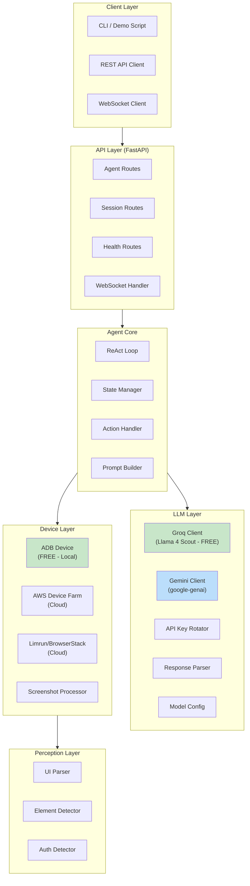

<div align="center">
# Android AI Agent 🤖📱
</div>

**AI-powered mobile automation agent designed for blind and visually impaired users.**

Transform natural language commands into Android device actions using advanced AI reasoning. Supports **FREE local emulator** via ADB or cloud device farms.

[](https://www.python.org/downloads/)
[](https://fastapi.tiangolo.com/)
[](https://console.groq.com/)
[](https://ai.google.dev/)
[](#testing)
[](https://opensource.org/licenses/MIT)

---

## 📖 Table of Contents

- [Overview](#overview)
- [Features](#features)
- [Architecture](#architecture)
- [Quick Start](#quick-start)
- [Installation](#installation)
- [Configuration](#configuration)
- [Usage](#usage)
- [API Reference](#api-reference)
- [Development](#development)
- [Testing](#testing)
- [Deployment](#deployment)
- [Contributing](#contributing)
- [License](#license)

---

## Overview

The Android AI Agent is an intelligent automation system that enables users to control Android devices through natural language commands. Specifically designed with accessibility in mind, it helps blind and visually impaired users interact with mobile applications independently.

### How It Works

```mermaid
flowchart TD
    A["👤 User: Open YouTube and search for music"] --> B["🤖 AI Agent"]
    B --> C{"ReAct Loop"}
    C --> D["👁️ Observe<br/>Screenshot + UI Tree"]
    D --> E["🧠 Think<br/>LLM Vision Analysis"]
    E --> F["âš¡ Act<br/>Tap/Swipe/Type"]
    F --> G{"Task Complete?"}
    G -->|No| C
    G -->|Yes| H["✅ Task Completed!"]

    E -.-> K["🟢 Groq Llama 4 Scout<br/>(FREE - 1000 RPD)"]
    E -.-> L["🔵 Google Gemini<br/>(Fallback)"]
    B -.-> I["📱 ADB Device<br/>(Local - FREE)"]
    B -.-> J["☁️ AWS Device Farm<br/>(Cloud)"]

    style A fill:#e1f5fe
    style H fill:#c8e6c9
    style K fill:#c8e6c9
    style L fill:#bbdefb
    style I fill:#fff9c4
    style J fill:#f3e5f5
```



The agent uses a **ReAct (Reasoning + Acting)** loop:
1. **Observe** - Capture screenshot and UI hierarchy
2. **Think** - LLM analyzes the screen and decides next action
3. **Act** - Execute the action (tap, swipe, type, etc.)
4. **Repeat** - Continue until task is complete

---

## Features

### 🎯 Core Capabilities

- **Natural Language Control** - Describe tasks in plain English
- **Multi-Step Reasoning** - Complex tasks broken into logical steps
- **Visual Understanding** - Groq Llama 4 Scout or Gemini vision analyzes screenshots
- **Dual LLM Provider** - Groq (free, 1000 req/day) as primary; Gemini as fallback
- **API Key Rotation** - Automatic circular key rotation with per-key cooldowns
- **Accessibility Tree Parsing** - Structured UI element detection
- **Authentication Handling** - Secure credential input prompts
- **Error Recovery** - Automatic retry with alternative strategies
- **FREE Local Device** - Use Android Emulator via ADB (zero cost!)

### ♿ Accessibility Features

- **TalkBack Integration** - Works with Android screen reader
- **Voice Announcements** - Audio feedback for actions
- **Haptic Feedback** - Vibration patterns for events
- **Blind-Friendly Design** - Clear, concise status updates

### 🔧 Technical Features

- **Local Device Control** - FREE ADB integration with emulator/USB devices
- **Cloud Device Farms** - AWS Device Farm, Limrun, and BrowserStack support
- **Groq LLM (Primary)** - Llama 4 Scout vision, 1000 req/day free tier
- **Gemini LLM (Fallback)** - Multimodal vision with API key rotation across 5+ keys
- **API Key Rotation** - Thread-safe circular rotation with per-key cooldowns
- **WebSocket Streaming** - Real-time progress updates
- **Async Architecture** - High-performance async/await
- **Modular Design** - Easy to extend and customize
- **Comprehensive Testing** - 314 tests (unit + integration + API)
- **Docker Support** - Easy deployment

---

## Architecture



### Project Structure

```
├── app/
│   ├── __init__.py           # Package initialization
│   ├── main.py               # FastAPI application entry
│   ├── config.py             # Configuration management
│   │
│   ├── agent/                # ReAct Agent Core
│   │   ├── react_loop.py     # Main reasoning loop
│   │   ├── state.py          # Agent state management
│   │   ├── prompts.py        # System prompts
│   │   └── actions/          # Action handlers
│   │       ├── handler.py    # Action dispatcher
│   │       ├── tap.py        # Tap actions
│   │       ├── swipe.py      # Swipe/scroll actions
│   │       ├── type_text.py  # Text input
│   │       ├── launch_app.py # App launcher
│   │       └── system.py     # System actions
│   │
│   ├── device/               # Device Abstraction
│   │   ├── cloud_provider.py # Cloud device ABC + factory
│   │   ├── adb_device.py     # ADB device (FREE - local)
│   │   ├── aws_device_farm.py # AWS Device Farm (cloud)
│   │   ├── limrun_client.py  # Limrun integration
│   │   ├── browserstack.py   # BrowserStack integration
│   │   └── screenshot.py     # Screenshot utilities
│   │
│   ├── perception/           # UI Understanding
│   │   ├── ui_parser.py      # Accessibility tree parser
│   │   ├── element_detector.py # Element detection
│   │   ├── auth_detector.py  # Login screen detection
│   │   └── ocr.py            # Text recognition
│   │
│   ├── llm/                  # LLM Integration
│   │   ├── client.py         # Gemini LLM client
│   │   ├── groq_client.py    # Groq LLM client (Llama 4 Scout)
│   │   ├── key_rotator.py    # API key rotation with cooldowns
│   │   ├── models.py         # Model configurations
│   │   └── response_parser.py # Parse agent responses
│   │
│   ├── accessibility/        # Accessibility Features
│   │   ├── announcer.py      # Voice announcements
│   │   ├── talkback.py       # TalkBack integration
│   │   └── haptics.py        # Haptic feedback
│   │
│   ├── api/                  # REST & WebSocket API
│   │   ├── routes/
│   │   │   ├── health.py     # Health checks
│   │   │   ├── sessions.py   # Device sessions
│   │   │   └── agent.py      # Agent endpoints
│   │   └── websocket.py      # Real-time streaming
│   │
│   └── utils/                # Utilities
│       ├── logger.py         # Structured logging
│       └── security.py       # Credential handling
│
├── tests/                    # Test suite
├── scripts/                  # Utility scripts
├── Dockerfile                # Container image
├── docker-compose.yml        # Service orchestration
└── requirements.txt          # Dependencies
```

---

## Quick Start

### Prerequisites

- Python 3.11+
- **LLM API Key** (one of):
  - Groq API key (FREE, recommended) - [Get FREE key](https://console.groq.com/keys)
  - Google AI API key (Gemini) - [Get FREE key](https://aistudio.google.com/apikey)
- **Device** (one of):
  - **Option A (FREE)**: Android SDK with emulator OR Android device connected via USB
  - **Option B (Cloud)**: AWS Device Farm, Limrun, or BrowserStack credentials

### 1. Clone and Install

```bash
git clone https://github.com/varunaditya27/android-ai-agent.git
cd android-ai-agent

# Create virtual environment
python -m venv venv
source venv/bin/activate  # Linux/Mac
# or: .\venv\Scripts\activate  # Windows

# Install dependencies
pip install -r requirements.txt
```

### 2. Configure Environment

```bash
# Copy example config
cp .env.example .env

# Edit with your credentials
nano .env
```

Required settings:
```env
# LLM Provider: "groq" (free, default) or "gemini"
LLM_PROVIDER=groq

# Groq (FREE - recommended): Get key at https://console.groq.com/keys
GROQ_API_KEY=gsk_your-groq-api-key

# OR Gemini (alternative): Get key at https://aistudio.google.com/apikey
# LLM_PROVIDER=gemini
# GEMINI_API_KEY=your-gemini-api-key

# Device: default is FREE local ADB (no config needed)
# For cloud: DEVICE_PROVIDER=aws_device_farm
```

### 3. Run the Server

```bash
# Development mode with hot reload
uvicorn app.main:app --reload --host 0.0.0.0 --port 8000

# Or use the demo script
python scripts/run_demo.py
```

### 4. Test It Out

```bash
# Health check
curl http://localhost:8000/health

# Or open the interactive demo
python scripts/run_demo.py --task "Open YouTube"
```

---

## Installation

### From Source

```bash
# Clone repository
git clone https://github.com/varunaditya27/android-ai-agent.git
cd android-ai-agent

# Create and activate virtual environment
python -m venv venv
source venv/bin/activate

# Install production dependencies
pip install -r requirements.txt

# Install development dependencies (optional)
pip install -e ".[dev]"
```

### Using Docker

```bash
# Build image
docker build -t android-ai-agent .

# Run container (Groq - free)
docker run -p 8000:8000 \
  -e GROQ_API_KEY=gsk_your-key \
  android-ai-agent

# Or with Gemini
docker run -p 8000:8000 \
  -e LLM_PROVIDER=gemini \
  -e GEMINI_API_KEY=your-key \
  android-ai-agent
```

### Using Docker Compose

```bash
# Start all services
docker-compose up -d

# View logs
docker-compose logs -f app

# Stop services
docker-compose down
```

---

## Configuration

### Environment Variables

Create a `.env` file with the following settings:

```env
# ===========================================
# LLM Provider Selection
# ===========================================
LLM_PROVIDER=groq                   # "groq" (free, default) or "gemini"

# ===========================================
# Groq Configuration (FREE - Recommended)
# ===========================================
# Get FREE API key at: https://console.groq.com/keys
# Free tier: 1000 req/day, 30 req/min, 30K tokens/min
GROQ_API_KEY=gsk_your-groq-api-key
GROQ_MODEL=meta-llama/llama-4-scout-17b-16e-instruct

# ===========================================
# Gemini Configuration (Alternative)
# ===========================================
# Get FREE API key at: https://aistudio.google.com/apikey
GEMINI_API_KEY=your-gemini-api-key
# Multiple keys for rotation (comma-separated, optional)
GEMINI_API_KEYS=key1,key2,key3,key4,key5
LLM_MODEL=gemini-2.5-flash           # or gemini-2.0-flash, gemini-1.5-pro
LLM_MAX_OUTPUT_TOKENS=2048
LLM_TEMPERATURE=0.1

# ===========================================
# Device Configuration
# ===========================================
# FREE Option (Recommended): Local ADB
DEVICE_PROVIDER=adb                  # FREE! Uses local emulator/USB device
ADB_DEVICE_SERIAL=                   # Leave empty for auto-detect

# Cloud Option: AWS Device Farm (uncomment to use)
# DEVICE_PROVIDER=aws_device_farm
# AWS_DEVICE_FARM_PROJECT_ARN=arn:aws:devicefarm:us-west-2:...
# AWS_ACCESS_KEY_ID=your-aws-key
# AWS_SECRET_ACCESS_KEY=your-aws-secret

# Cloud Option: Limrun / BrowserStack (uncomment to use)
# DEVICE_PROVIDER=limrun
# LIMRUN_API_KEY=your-limrun-key

# ===========================================
# Server Configuration
# ===========================================
SERVER_HOST=0.0.0.0
SERVER_PORT=8000
DEBUG=true
LOG_LEVEL=INFO
CORS_ORIGINS=*

# ===========================================
# Agent Configuration
# ===========================================
MAX_STEPS=30
MIN_STEP_INTERVAL=3.0                # 3s for Groq (30 RPM), 12s for Gemini
```

### LLM Provider Comparison

| Provider | Model | Cost | Rate Limit | Vision | Best For |
|----------|-------|------|------------|--------|----------|
| **Groq** (default) | Llama 4 Scout | **FREE** | 1000 RPD / 30 RPM | ✅ | Development, Production |
| **Gemini** (fallback) | Gemini 2.5 Flash | Free tier | ~20 RPD (vision) | ✅ | Higher quality fallback |

### Device Provider Comparison

```mermaid
flowchart LR
    subgraph FREE["FREE Options 🆓"]
        ADB["ADB + Emulator"]
        USB["ADB + USB Device"]
    end

    subgraph CLOUD["Cloud Options ☁️"]
        AWS["AWS Device Farm"]
        Limrun["Limrun Cloud"]
        BS["BrowserStack"]
    end

    ADB --> |"$0/month"| Local["Local Development"]
    USB --> |"$0/month"| Local
    AWS --> |"Pay per minute"| Cloud["Production/Scale"]
    Limrun --> |"Pay per minute"| Cloud
    BS --> |"Pay per minute"| Cloud

    style FREE fill:#c8e6c9
    style CLOUD fill:#fff9c4
```



| Provider | Cost | Latency | Setup | Best For |
|----------|------|---------|-------|----------|
| **ADB (Local)** | FREE | Very Low | Android SDK | Development, Testing |
| **AWS Device Farm** | $$ | Medium | AWS credentials | CI/CD, Real devices |
| **Limrun** | $$ | Medium | API Key | Production |
| **BrowserStack** | $$$ | Medium | API Key | Enterprise |

---

## Usage

### Interactive Demo

```bash
# Start interactive session
python scripts/run_demo.py

# With a specific task
python scripts/run_demo.py --task "Open Chrome and search for weather"
```

### REST API

```python
import requests

# Create a session
session = requests.post("http://localhost:8000/sessions", json={
    "device_type": "android",
    "timeout_minutes": 30
}).json()

session_id = session["session_id"]

# Execute a task
result = requests.post("http://localhost:8000/agent/execute", json={
    "session_id": session_id,
    "task": "Open YouTube and search for cooking videos",
    "max_steps": 30
}).json()

print(f"Success: {result['success']}")
print(f"Result: {result['result']}")

# Cleanup
requests.delete(f"http://localhost:8000/sessions/{session_id}")
```

### WebSocket Streaming

```javascript
const ws = new WebSocket(`ws://localhost:8000/ws/${sessionId}`);

ws.onopen = () => {
  // Start a task
  ws.send(JSON.stringify({
    type: "start_task",
    data: {
      task: "Open Settings and enable WiFi",
      max_steps: 30
    }
  }));
};

ws.onmessage = (event) => {
  const message = JSON.parse(event.data);

  switch (message.type) {
    case "step_update":
      console.log(`Step: ${message.data.action_type}`);
      console.log(`Thinking: ${message.data.thinking}`);
      break;

    case "input_required":
      // Handle credential input
      const password = prompt(message.data.prompt);
      ws.send(JSON.stringify({
        type: "provide_input",
        data: { value: password }
      }));
      break;

    case "task_completed":
      console.log(`Done! ${message.data.result}`);
      break;
  }
};
```

### Python SDK

```python
import asyncio
from app.agent import ReActAgent, AgentConfig
from app.device.cloud_provider import create_cloud_device
from app.llm.groq_client import GroqLLMClient
from app.llm.models import LLMConfig

async def main():
    # Setup device (FREE local ADB)
    device = await create_cloud_device(
        provider="adb",  # FREE! Uses local emulator
        device_id=None,  # Auto-detect device
    )
    await device.connect()

    # Setup LLM (Groq - FREE, 1000 req/day!)
    llm_config = LLMConfig(
        api_key="gsk_your-groq-key",
        model="meta-llama/llama-4-scout-17b-16e-instruct",
    )
    llm = GroqLLMClient(llm_config)

    # Or use Gemini with API key rotation:
    # from app.llm.client import LLMClient
    # from app.llm.key_rotator import ApiKeyRotator
    # rotator = ApiKeyRotator(["key1", "key2", "key3"])
    # llm = LLMClient(LLMConfig(api_key=rotator.get_key(), model="gemini-2.5-flash"))

    # Create agent
    agent = ReActAgent(
        llm_client=llm,
        device=device,
        config=AgentConfig(max_steps=30),
    )

    # Run task
    result = await agent.run("Open YouTube and play trending videos")

    print(f"Success: {result.success}")
    print(f"Result: {result.result}")

    # Cleanup
    await device.disconnect()

asyncio.run(main())
```

---

## API Reference

### Health Endpoints

| Endpoint | Method | Description |
|----------|--------|-------------|
| `/health` | GET | Basic health check |
| `/health/ready` | GET | Readiness probe |
| `/health/live` | GET | Liveness probe |
| `/health/info` | GET | Service information |

### Session Endpoints

| Endpoint | Method | Description |
|----------|--------|-------------|
| `/sessions` | POST | Create new session |
| `/sessions` | GET | List all sessions |
| `/sessions/{id}` | GET | Get session details |
| `/sessions/{id}` | DELETE | Delete session |
| `/sessions/{id}/screenshot` | GET | Capture screenshot |

### Agent Endpoints

| Endpoint | Method | Description |
|----------|--------|-------------|
| `/agent/execute` | POST | Execute task (blocking) |
| `/agent/status/{session_id}` | GET | Get agent status |
| `/agent/input` | POST | Provide user input |
| `/agent/cancel/{session_id}` | POST | Cancel task |
| `/agent/quick-action` | POST | Execute single action |

### WebSocket

| Endpoint | Description |
|----------|-------------|
| `/ws/{session_id}` | Real-time task streaming |

---

## Development

### Setup Development Environment

```bash
# Install dev dependencies
pip install -e ".[dev]"

# Install pre-commit hooks
pre-commit install
```

### Code Quality

```bash
# Format code
black app/ tests/

# Lint
ruff check app/ tests/

# Type checking
mypy app/
```

### Project Structure Guidelines

- **Modular Design**: Each module has a single responsibility
- **Async First**: Use `async/await` for I/O operations
- **Type Hints**: Full type annotations for all functions
- **Documentation**: Docstrings for all public APIs
- **Error Handling**: Graceful error recovery

---

## Testing

### Run Tests

```bash
# All tests
pytest tests/ -v

# With coverage
pytest tests/ -v --cov=app --cov-report=html

# Specific test file
pytest tests/test_agent.py -v

# Specific test
pytest tests/test_agent.py::TestAgentState::test_start_task -v
```

### Test Categories (314 tests)

- **Unit Tests**: Individual component testing
- **Integration Tests**: Multi-component workflows
- **API Tests**: FastAPI endpoint testing
- **LLM Client Tests**: Groq client, Gemini client, key rotation
- **Security Tests**: Credential handling, input validation

### Docker Test Runner

```bash
docker-compose --profile test up test
```

---

## Deployment

### Production Checklist

- [ ] Set `SERVER_DEBUG=false`
- [ ] Set `SERVER_ENVIRONMENT=production`
- [ ] Configure proper `SERVER_CORS_ORIGINS`
- [ ] Use strong API keys
- [ ] Enable HTTPS (reverse proxy)
- [ ] Set up monitoring/logging
- [ ] Configure rate limiting

### Docker Compose Production

```bash
# Production deployment
docker-compose -f docker-compose.yml up -d

# Scale workers
docker-compose up -d --scale app=3
```

### Kubernetes

```yaml
apiVersion: apps/v1
kind: Deployment
metadata:
  name: android-ai-agent
spec:
  replicas: 3
  selector:
    matchLabels:
      app: android-ai-agent
  template:
    metadata:
      labels:
        app: android-ai-agent
    spec:
      containers:
      - name: agent
        image: android-ai-agent:latest
        ports:
        - containerPort: 8000
        env:
        - name: LLM_API_KEY
          valueFrom:
            secretKeyRef:
              name: agent-secrets
              key: llm-api-key
        livenessProbe:
          httpGet:
            path: /health/live
            port: 8000
        readinessProbe:
          httpGet:
            path: /health/ready
            port: 8000
```

---

## Contributing

We welcome contributions! Please see our contributing guidelines.

### Development Workflow

1. Fork the repository
2. Create a feature branch (`git checkout -b feature/amazing-feature`)
3. Make your changes
4. Run tests (`pytest tests/ -v`)
5. Run linting (`ruff check . && black --check .`)
6. Commit your changes (`git commit -m 'Add amazing feature'`)
7. Push to branch (`git push origin feature/amazing-feature`)
8. Open a Pull Request

### Code Style

- Follow PEP 8 guidelines
- Use type hints
- Write docstrings (Google style)
- Keep functions focused and small
- Write tests for new features

---

## License

This project is licensed under the MIT License - see the [LICENSE](LICENSE) file for details.

---

## Acknowledgments

- Groq for free-tier Llama 4 Scout vision API
- Google for Gemini multimodal AI capabilities
- Meta for Llama 4 Scout open model
- Android SDK team for ADB tooling
- AWS Device Farm, Limrun, and BrowserStack for cloud device infrastructure
- The accessibility community for invaluable feedback

---

## Support

- 📧 Email: support@example.com
- 💬 Discord: [Join our community](https://discord.gg/example)
- 🐛 Issues: [GitHub Issues](https://github.com/yourusername/android-ai-agent/issues)

---

<p align="center">
  Made with ❤️ for accessibility
</p>
